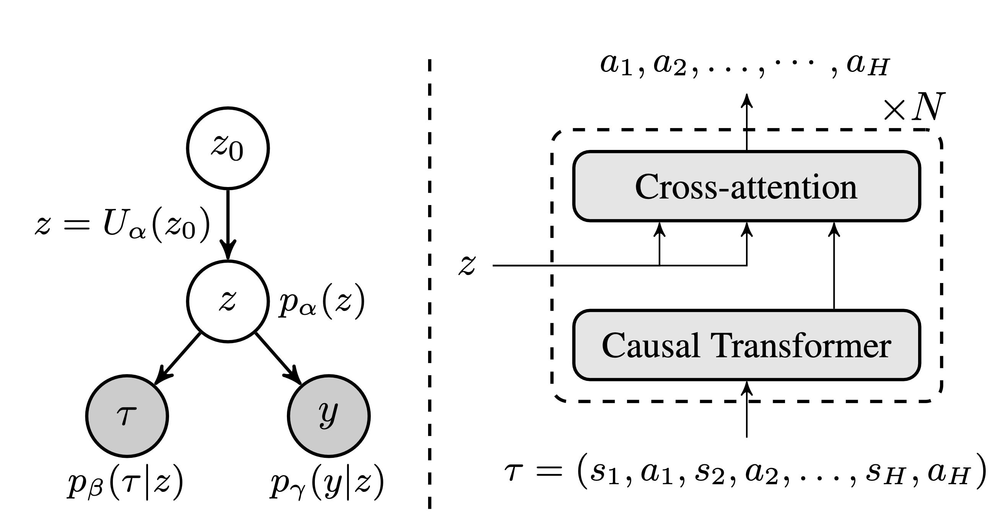
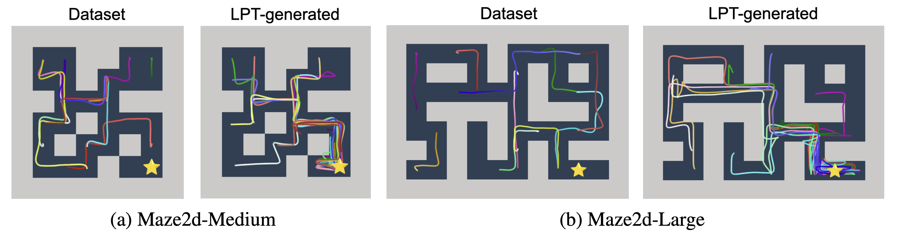

# Latent Plan Transformer for Trajectory Abstraction: 
## Planning as Latent Space Inference
Deqian Kong*, Dehong Xu*, Minglu Zhao*, Bo Pang, Jianwen Xie, Andrew Lizarraga, Yuhao Huang, Sirui Xie*, Ying Nian Wu

*Equal contribution

[[Paper link](https://arxiv.org/abs/2402.04647)], [[Project page](https://sites.google.com/view/latent-plan-transformer/home)]

## Overview

Official repository for paper **Latent Plan Transformer for Trajectory Abstraction: Planning as Latent Space Inference** (NeurIPS 2024) 

We introduce the **Latent Plan Transformer** (LPT), a model that enhances planning without step-wise rewards by leveraging a latent space to connect a Transformer-based trajectory generator to the final return. Trained on trajectory-return pairs, LPT infers latent variables from expected returns before execution, realizing *planning as inference* and achieving competitive performance across benchmarks.

<p align="center">


</p>


## LPT Training

### Installation

Follow the instructions in the [mujoco-py repo](https://github.com/openai/mujoco-py) to install MuJoCo.
Then, dependencies can be installed with the following command:

```bash
conda env create -f env.yml
```

### Downloading datasets

Install the [D4RL repo](https://github.com/rail-berkeley/d4rl) following the instructions.
Then, run the following script in order to download the datasets and save them in our format:

```bash
cd data
python process_data.py
```

## Example usage

Experiments can be reproduced with the following:

```bash
cd scripts
python train.py --env_name maze2d-medium
```

To customize or experiment with different environments, the environment-specific configurations, such as the number of layers, context length, and learning rate, can be found in `scripts/config.py`. This file defines parameters for each supported environment and allows the script to adjust its training configuration dynamically based on the `--env_name` argument. 

The `config.py` file includes various environments including Gym-Mujoco, Maze2D, and Franka Kitchen environments, with detailed specifications for parameters:
- `n_layer`: Number of layers in the model.
- `n_head`: Number of attention heads.
- `hidden_size`: Dimensionality of the hidden layer.
- `context_len`: Length of the context window for processing input sequences.
- `learning_rate`: Learning rate used during training.
- `langevin_step_size`: Step size for Langevin dynamics.
- `env_targets`: Target return values for each environment.
- `max_len`: Maximum episode length.


## Reference
```
@article{kong2024latent,
  title={Latent Plan Transformer for Trajectory Abstraction: Planning as Latent Space Inference},
  author={Kong, Deqian and Xu, Dehong and Zhao, Minglu and Pang, Bo and Xie, Jianwen and Lizarraga, Andrew and Huang, Yuhao and Xie, Sirui and Wu, Ying Nian},
  journal={Advances in Neural Information Processing Systems},
  year={2024}
}
```


## Acknowledgements

The decision transformer model implementation is based on the [official repository of DT](https://github.com/kzl/decision-transformer) .
